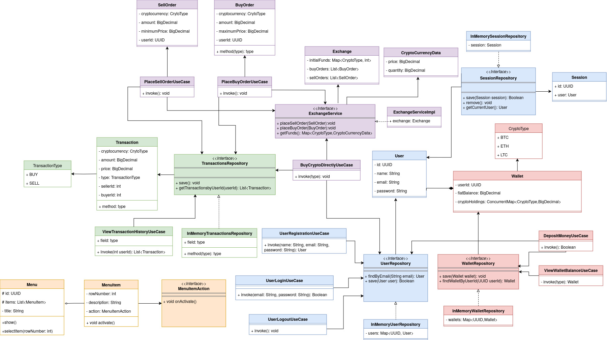

# Crypto Exchange System

## Table of Contents
1. [Project Description](#project-description)
2. [Features](#features)
3. [Architecture](#architecture)
4. [Design Patterns](#design-patterns)
5. [UML Diagram](#uml-diagram)
6. [Implementation Details](#implementation-details)

## Project Description
The cryptocurrency exchange system is a platform for trading cryptocurrencies. It provides users with a secure and efficient environment to buy, sell, and manage various cryptocurrencies. The system implements a robust architecture and incorporates real-time market simulations to offer a realistic trading experience.

## Features
- **User Registration and Authentication**
- **Wallet Management (Fiat and Cryptocurrencies)**
- **Real-time Cryptocurrency Price Updates**
- **Order Placement (Buy and Sell)**
- **Order Matching and Execution**
- **Transaction History Tracking**
- **Direct Cryptocurrency Purchases from Exchange**
- **Simulated Market Price Fluctuations**

## Architecture
This project implements a Hexagonal (Ports and Adapters) Architecture, which promotes separation of concerns and modularity. The core business logic is isolated from external concerns, making the system more maintainable and adaptable to change.

### Key Components
- **Domain Layer:** Contains the core business logic and entities
- **Application Layer:** Orchestrates the flow of data and manages use cases
- **Infrastructure Layer:** Handles external concerns such as data persistence and UI

## Design Patterns
The following design patterns have been utilized in this project:
- Singleton

## UML Diagram

## Implementation Details
The Crypto Exchange System has been implemented with the following key features:

### User Management:
- Registration with unique user IDs
- Secure login and authentication
- User profiles with associated wallets

### Wallet System:
- Support for fiat (USD) and multiple cryptocurrencies

### Order Management:
- Placement of buy and sell orders
- Order book maintenance
- Efficient order matching algorithm

### Transaction Processing:
- Atomic execution of matched orders
- Update of user wallets post-transaction
- Detailed transaction history logging

### Direct Exchange Purchases:
- Ability to buy cryptocurrencies directly from the exchange

### Market Simulation:
- Multi-threaded implementation for real-time exchange price updates
- Random price fluctuations for supported cryptocurrencies (BTC, ETH, LTC)
- Price range: $500 - $1,000,000
- Update frequency: Every 5 seconds

### Error Handling:
- Robust error checking and validation
- User-friendly error messages
